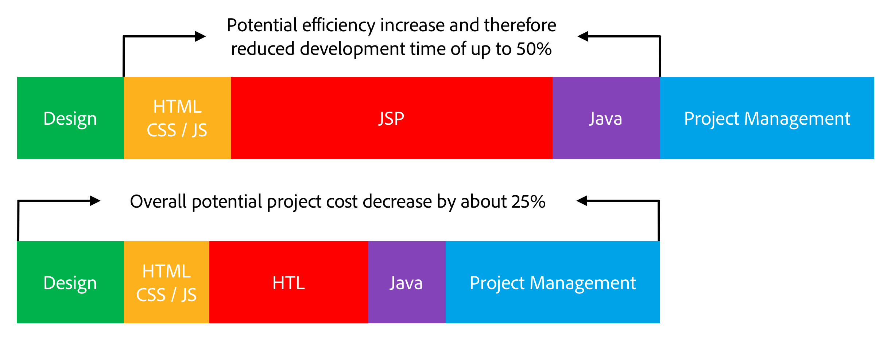

# Översikt {#overview}

Syftet med HTML-mallspråk (HTL), som stöds av Adobe Experience Manager (AEM), är att erbjuda ett högproduktivt webbramverk på företagsnivå som ökar säkerheten och gör att HTML-utvecklare utan Java-kunskaper bättre kan delta i AEM-projekt.

HTML-mallspråket introducerades med AEM 6.0 och ersätter JSP (JavaServer Pages) som det rekommenderade serversidesmallsystemet för HTML. För webbutvecklare som behöver bygga robusta företagswebbplatser kan HTML-mallspråket bidra till ökad säkerhet och effektivare utveckling.

## Ökad säkerhet {#increased-security}

HTML-mallspråket ökar säkerheten för webbplatser som använder det i implementeringen, jämfört med JSP och de flesta andra mallsystem, eftersom HTML automatiskt kan använda rätt kontextmedveten escape-konvertering för alla variabler som skrivs ut i presentationslagret. HTML gör detta möjligt eftersom det förstår HTML-syntaxen och använder den kunskapen för att justera den nödvändiga escape-konverteringen för uttryck baserat på deras position i koden. Detta resulterar t.ex. i att uttryck som placeras i `href` eller `src` attribut escape-konverteras på ett annat sätt än uttryck som placeras i andra attribut, eller någon annanstans.

Även om samma resultat kan uppnås med mallspråk som JSP, måste utvecklaren manuellt se till att rätt escape-konvertering tillämpas på varje variabel. Eftersom ett enda utelämnande eller fel på den tillämpade escape-konverteringen potentiellt är tillräckligt för att orsaka en XSS-säkerhetslucka (cross-site scripting) beslutade vi oss för att automatisera den här åtgärden med HTML. Vid behov kan utvecklare fortfarande ange olika escape-värden för uttrycken, men med HTML är standardbeteendet troligare att det motsvarar det önskade beteendet, vilket minskar risken för fel.

## Förenklad utveckling {#simplified-development}

HTML-mallspråket är enkelt att lära sig och funktionerna i det begränsas för att säkerställa att det är enkelt och rakt framåt. Den har också kraftfulla mekanismer för att strukturera markeringar och anropa logik, samtidigt som den alltid tvingar fram strikt åtskillnad mellan markeringar och logik. Själva HTML-koden är standard-HTML5 eftersom den använder uttryck och dataattribut för att kommentera koden med önskat dynamiskt beteende, vilket innebär att den inte bryter giltigheten för koden och gör den läsbar. Observera att utvärderingen av uttrycken och dataattributen görs helt på serversidan och inte visas på klientsidan, där önskat JavaScript-ramverk kan användas utan att störa.

Tack vare dessa funktioner kan HTML-utvecklare utan Java-kunskaper och med liten produktspecifik kunskap redigera HTML-mallar, vilket gör att de kan vara en del av utvecklingsteamet och effektivisera samarbetet med Java-utvecklare i full hög. Och tvärtom gör det att Java-utvecklare kan fokusera på backend-koden utan att behöva oroa sig för HTML.

## Minskade kostnader {#reduced-costs}

Ökad säkerhet, förenklad utveckling och förbättrat teamsamarbete, innebär att AEM-projekt kan implementeras med minskad insats, snabbare time to market (TTM) och lägre total ägandekostnad.

Av det som har observerats när Adobe.com-webbplatsen implementeras på nytt med HTML-mallspråket är att kostnaden och varaktigheten för projektet kan minskas med cirka 25 %.

Diagrammet ovan visar följande effektivitetsförbättringar som kan göras möjliga av HTML:

* **HTML/CSS/JS:** Eftersom HTML-utvecklarna kan redigera HTML-mallar direkt behöver inte frontsidorna implementeras separat från AEM-projektet längre, utan kan implementeras direkt i de faktiska AEM-komponenterna. Detta minskar antalet svåra iterationer med Java-utvecklare i full-stack.
* **JSP / HTML:** Eftersom HTML inte kräver någon Java-kunskap och är enkel att skriva, kan alla utvecklare med HTML-expertis redigera mallarna.
* **Java:** Tack vare det tydliga och lättanvända Use-API:t som tillhandahålls av HTL har gränssnittet med affärslogiken klargjorts, vilket även gynnar Java-utvecklingen generellt.

**Läs nästa:**

* [Komma igång med HTML-mallspråket](getting-started.md)
